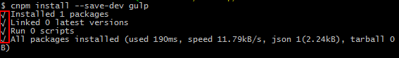
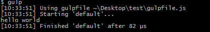

gulp 安装
---------------

由于墙的关系 , `npm` 实质是使用 `cnpm` 代替

## 全局

全局安装 gulp , 若全局环境已经有了 , 则忽略

    npm install --global gulp


## 项目文件夹


在项目文件夹 新建 `package.json` 文件,可以通过以下命令

    npm init

在项目文件夹中安装 , 作为开发依赖（devDependencies）

    npm install --save-dev gulp

安装成功如下:



在项目根目录下创建一个名为 `gulpfile.js` 的文件

`gulpfile.js` 是 `gulp` 项目的配置文件，一般是位于项目根目录的普通js文件 , 由于`gulpfile.js`里面的路径都是相对目录 , 都是相对于`gulpfile.js`所在目录 , 所以`gulpfile.js`放在项目根目录比较好

命令行调用 `gulp <task>` 命令时 , 会在终端定位所在文件夹中寻找 `gulpfile.js` , 找不到往上级文件夹找知道找到 , 然后运行`gulpfile.js`里面的已经写好的任务

`gulpfile.js`里测试代码如下

    var gulp = require('gulp');

    gulp.task('default', function() {
        console.log("hello world");
    });

运行

    gulp

或者

    gulp default

可以再终端中看到结果



gulp 命令行语法 **调用任务**

    gulp <task> <othertask>

`gulp` 等价于 `gulp default`


### 安装gulp插件

以下列举了我常用的插件,其实gulp插件实际也是node的插件,安装与安装node插件方法一样

* gulp-less -- less转换为css

        npm install --save-dev gulp-less

* browser-sync -- 浏览器同步刷新 解放F5

    可以方法插件名字没有gulp-,其实这个插件可以不依赖gulp去运行,详情看官网,或者有道云笔记里面的`"nodejs,gulp,git"`文件夹中的 `"Browsersync"` 笔记

        npm install --save-dev browser-sync

* gulp-clean-css -- 压缩css

        npm install --save-dev gulp-clean-css

* gulp-rename -- 改文件名

        npm install --save-dev gulp-rename

也可以一次性安装全部

    npm install gulp-less browser-sync gulp-clean-css gulp-rename --save-dev

### 配置 `gulpfile.js` 使用 gulp插件

`gulp`使用的是**Node.js**平台 即遵循CommonJS规范 通过require()方法加载模块,记得一定记住加载`gulp`模块

    var gulp = require('gulp');

先加载模块,模块一般在`pipe()`直接作为函数调用即可

    var someplugin = require('someplugin');

在任务中调用模块

    gulp.task('test', function() {
        gulp.src().pipe(someplugin())
    });

具体语法查看[配置gulpfile.js时,有四个比较常用的方法](#gulpfilejs) 或者 [官方文档](http://www.gulpjs.com.cn/docs/api/)


## 配置`gulpfile.js`时,有四个比较常用的方法

* [gulp.task](#gulptask)

* [gulp.src](#gulpsrc)

* [gulp.dest](#gulpdest)

* [gulp.watch](#gulpwatch)

#### gulp.task

    gulp.task(name[, deps], fn)

定义一个使用 [Orchestrator](https://github.com/robrich/orchestrator) 实现的任务（task）。用于在命令行中调用或者在其他任务中调用

* `name` 任务的名字，如果你需要在命令行中运行你的某些任务，那么，请不要在名字中使用空格

* `deps` 类型：Array 一个包含任务列表的数组，这些任务会在你当前任务运行之前完成。

* `fn` 该函数定义任务所要执行的一些操作。通常来说，它会是这种形式：`gulp.src().pipe(someplugin())` 或者 `gulp.watch(...).on("change",function(){...})`。

执行任务时 , 先把参数中数组的任务执行了 , 再执行fn .

e.g. :

1. 定义一个test任务 , 并在命令行中调用

        gulp.task('test', function() {
            console.log("hello world");
        });

    命令行

        gulp test

2. 定义一个new任务 , 调用时先运行test任务

        gulp.task('new',["test"],function(){
            console.log("haha");
        });


#### gulp.src

    gulp.src(globs[, options])

输出（Emits）符合所提供的匹配模式（glob）或者匹配模式的数组（array of globs）的文件。 将返回一个 Vinyl files 的 stream 它可以被 piped(即用到 **Node.js** 的 `readable.pipe(destination[, options])`方法) 到别的插件中。

* `globs` 类型： String 或 Array 所要读取的 glob 或者包含 globs 的数组。

    glob 请参考 node-glob 语法

* `options` 类型： Object 通过 glob-stream 所传递给 node-glob 的参数。 *没用过*

    除了 node-glob 和 glob-stream 所支持的参数外，gulp 增加了一些额外的选项参数：

    1. `options.buffer` 类型： Boolean 默认值： true

        如果该项被设置为 false，那么将会以 stream 方式返回 file.contents 而不是文件 buffer 的形式。这在处理一些大文件的时候将会很有用。**注意：**插件可能并不会实现对 stream 的支持。

    2. `options.read` 类型： Boolean 默认值： true

        如果该项被设置为 false，那么将会以 stream 方式返回 file.contents 而不是文件 buffer 的形式。这在处理一些大文件的时候将会很有用。**注意：**插件可能并不会实现对 stream 的支持。

    3. `options.base` 类型： String 默认值： 将会加在 glob 之前


        ```javascript
        gulp.src('client/js/**/*.js') // 匹配 'client/js/somedir/somefile.js' 并且将 `base` 解析为 `client/js/`
          .pipe(minify())
          .pipe(gulp.dest('build'));  // 写入 'build/somedir/somefile.js'

        gulp.src('client/js/**/*.js', { base: 'client' })
          .pipe(minify())
          .pipe(gulp.dest('build'));  // 写入 'build/js/somedir/somefile.js'
        ```

        读取文件路径可拆分为  base + 中间路径 + 文件 第一个例子中 *中间路径*为`somedir/` 第二个例子给定了base *中间路径*为 `js/somedir/` ;然后写入路径又会根据读取路径计算的 path + 中间路径 + 文件;所以第一个写地址`'build/'+'somedir/'+'somefile.js'` 第二个写入地址 `'build/'+'js/somedir/'+'somefile.js'`

#### gulp.dest

    gulp.dest(path[, options])

能被 pipe 进来，并且将会写文件。并且重新输出（emits）所有数据，因此你可以将它 pipe 到多个文件夹。如果某文件夹不存在，将会自动创建它。

* `path` 类型： String or Function

    文件将被写入的路径（输出目录）。也可以传入一个函数，在函数中返回相应路径，这个函数也可以由 vinyl 文件实例 来提供。

* `options` 类型： Object

    1. `options.cwd` 类型： String 默认值： process.cwd()

        输出目录的 cwd 参数，只在所给的输出目录是相对路径时候有效。

    2. `options.mode` 类型： String 默认值： 0777

        八进制权限字符，用以定义所有在输出目录中所创建的目录的权限。

文件被写入的路径是以所给的相对路径根据所给的目标目录计算而来。类似的，相对路径也可以根据所给的 base 即`options.base`来计算。 请查看上述的 gulp.src 来了解更多信息。

`gulp.src()`匹配到的文件时,路径可拆分为:

**base + 中间路径 + 文件**

写入地址路径即为 **path + 中间路径 + 文件**

```javascript
gulp.src('client/templates/*.jade')
  .pipe(jade()) //对流进行了jade操作
  .pipe(minify()) //对流进行了minify压缩操作
  .pipe(gulp.dest('build/minified_templates'));//写入文件
```
```javascript
gulp.src('./client/templates/*.jade')
  .pipe(jade())
  .pipe(gulp.dest('./build/templates'))
  .pipe(minify())
  .pipe(gulp.dest('./build/minified_templates'));
```
```javascript
// 一个简单的复制文件
gulp.src('index.html').pipe(gulp.dest('new')).pipe(gulp.dest('new/new')).pipe(gulp.dest('./'))
```

如果path的地址为读取文件地址,会覆盖源文件


> 简单来说gulp.src(path)就是返回一个stream流 , 我们把文件比作装水的桶，而水就是文件里的内容 , 流过每个pipe()管 , 执行管内操作 , 流过可以继续流过别的管 , 进行再一步修改文件内容

#### gulp.watch

    gulp.watch(glob [, opts], tasks) 或 gulp.watch(glob [, opts, cb])

监视文件，并且可以在文件发生改动时候做一些事情。它总会返回一个 EventEmitter 来发射（emit） change 事件。

    gulp.watch(glob[, opts], tasks)

* `glob` 类型： String or Array

    一个 glob 字符串，或者一个包含多个 glob 字符串的数组，用来指定具体监控哪些文件的变动。

* `opts` 类型： Object

    传给 gaze 的参数

* `tasks` 类型： Array

    需要在文件变动后执行的一个或者多个通过 `gulp.task()` 创建的 task 的名字

    ```javascript
    var watcher = gulp.watch('js/**/*.js', ['uglify','reload']);
    watcher.on('change', function(event) {
        console.log('File ' + event.path + ' was ' + event.type + ', running tasks...');
    });
    ```
    ```javascript
    gulp.watch('js/**/*.js', ['uglify','reload']).on('change', function(event) {
        console.log('File ' + event.path + ' was ' + event.type + ', running tasks...');
    });
    ```

返回的 EventEmitter 来发射（emit） change 事件,会被传入一个名为 event 的对象

 * `event.type` 类型： String

    发生的变动的类型：added, changed 或者 deleted。

* `event.path` 类型： String

    触发了该事件的文件的路径。

`gulp.watch()`中`tasks`的参数,最好不要是监视任务,是一次性任务(任务里面没有watch),否则就会出现好多重监视

    gulp.watch(glob[, opts, cb])

* `cb`(event) 类型： Function

    每次变动需要执行的 callback。相当于上面的on(change,function(event){})的回调函数


