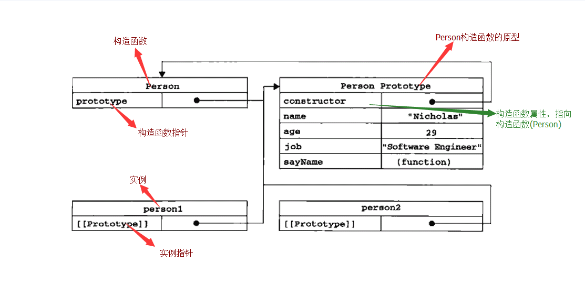

# 面向对象

## 操作符

* `instanceof`

    用于判断是否该构造函数的实例

    ``` javascript
        person1 instanceof Person
    ```

* `Object.getPrototypeOf()`

    返回实例`[[Prototype]]`的值（ES5新方法）

    ``` javascript
    Object.getPrototypeOf(person1)
    ```

* `isPrototypeof()`

    用于检测特定实例是否原型的实例，true表示是。

    ``` javascript
        Person.prototype.isPrototypeOf(person1)
    ```

* `hasOwnProperty()`

    用于检测属性是存在于实例，还是原型，true表示来自实例

    ``` javascript
    person1.hasOwnProperty("name")
    ```

* `Object.getOwnPropertyNames()`

    返回一个由指定对象的所有自身属性的属性名（包括不可枚举属性）组成的数组。

## 创建对象

1. 工厂模式

    ``` javascript
    function createPeople(name, age, job) {
        var o = new Object(); //var o = {};
        o.name = name;
        o.age = age;
        o.job = job;
        o.sayName = function() {
            alert(this.name)
        }
        return o;
    }
    var people1 = createPeople("nicholas", 29, "software engineer");
    var people2 = createPeople("greg", 23, "doctor");
    ```

    工厂模式虽然解决创建多个相似对象的问题，但是没有解决对象识别的问题，即怎么知道一个对象的类型（引用类型）

2. 构造函数模式

    ``` javascript
    function Person(name, age, job) {
        this.name = name;
        this.age = age;
        this.job = job;
        this.sayName = function() {
            alert(this.name);
        } //等价于 this.sayName = new Function("alert(this.name)");
    }
    var person1 = new Person("nicholas2", 39, "old software engineer");
    var person2 = new Person("greg2", 33, "old doctor");
    ```

    构造函数与工厂模式区别：
    1. 构造函数里面没有创建对象；
    2. 构造函数直接将属性和方法赋给this对象；
    3. 构造函数里面没有return语句。
    4. 构造函数首字母大写(约定俗成，构造函数始终都以大写字母开头，非构造函数以小字母开头)，创建新实例，必须用到new操作符。

    用new创建一个新实例，实际经历以下四个过程：
    1. 创建一个新对象（就是实例，实例就在new的第一步创建了）；
    2. 将构造函数作用域赋给新对象(所以this就指向这个新对象)；
    3. 执行构造函数中代码(为新对象添加属性)；
    4. 返回新对象(相当于返回this)。

    构造函数缺点： *不同实例上的同名函数是不相等的*。

3. 原型

    我们创建的每个函数都有一个prototype（原型）属性，这个属性是一个指针，指向一个对象（原型对象），而这个对象的用途是包含可以有特定类型的所有实例共享的属性和方法。

    在默认情况下，所有原型对象都会自动获得一个constructor(构造函数)属性。

    ``` javascript
    function Person() {
    }
    Person.prototype.name = "Nicholas";
    Person.prototype.age = 29;
    Person.prototype.job = "Software Engineer";
    Person.prototype.sayName = function() {
        console.log(this.name);
    }
    var person1 = new Person();
    var person1 = new Person();
    ```

    

    概念：
    * function Person() -- 构造函数
    * Person.prototype -- 构造函数指向原型对象的指针（其实在js里面任何引用类型值都是指针，都不是实际的值，实际的值在内存中），指针指向哪个对象，哪个对象就是构造函数的原型（可以设置构造函数的原型，不一定就是创造构造函数时自动创建的那个原型对象）

        指向的对象在创建实例的时候，会被实例的`[[Prototype]]`属性指向，从而连接实例和原型。

    * person1 -- 实例
    * person1的`[[Prototype]]` -- 实例指向构造函数原型对象的指针(不可以直接访问)，指向 Person.prototype （实例被创建时的Person.prototype）。

        这个连接是存在于实例和构造函数的原型之间，而不是存在实例和构造函数之间。

        意思就是创建实例的时候，实例（假设叫实例1）指向的是实例1本身被创建时（new 调用的第一步）构造函数prototype指向的对象（假设叫做 Prototype1），实例1和原型（Prototype1）连接就在这时候建立，后面就算构造函数重新设置prototype指向的对象（假设叫做 Prototype2），实例1还是和原来的原型（Prototype1）连接。新建的实例（实例2）同样会根据被创建时，构造函数prototype指向的对象（Prototype2）来建立和原型（Prototype2）的连接，以此类推。

    * Person Prototype -- (Person及Person实例)的原型对象（存在于内存中，不可以直接操作）
    * 原型对象上的constructor属性 或者 Person.prototype.constructor -- 指向回构造函数(Person)
    * person1.的constructor属性 -- 即系Person.prototype.constructor

        为什么实例上明明没有constructor属性，但是却读取到constructor属性。

        因为解析器读取实例属性的时候，先读取实例的属性，如果实例自身没有；则在实例的原型那里寻找。

        实例(person1)的constructor属性 就是 构造函数(Person)的原型对象(Person Prototype)的constructor属性（实例属性没constructor的时候，因为实例没有所以在原型上寻找) 指向构造函数(Person)本身

    第二种原型写法，重写原型(将原型指向一个新的对象)

    ``` javascript
    Person.prototype = {
        constructor:Person,
        name: "Nicholas",
        age: 29,
        job: "Software Engineer",
        sayName: function() {
            console.log(this.name);
        }
    }
    ```

    这种写法有以下特点:
    1. 写法更加简单
    2. 一定要重定向，就是一定要设置constructor属性（因为constructor本来是自动获取的，重写原型后，会确实constructor，所以要重新设置）。但是这样会导致constructor可枚举
    3. 重写后，原型指向新的对象。但是重写后创建的实例原型才是指向新的原型，重写前创建的对象还是指向原来的原型。这里值得注意，否则好容易出错。特别是在构造函数里面修改原型的话，不要使用重写原型的方式，因为用new调用构造函数的时候，已经创建了实例，然后再运行构造函数里面的重写原型语句，就是这个实例就会没有新原型里面的属性方法。

#### 创建对象的各种模式

1. 工厂模式
2. 组合使用构造函数模式和原型模式(最常用)

    ``` javascript
    function Person(name, age, job) {
        this.name = name;
        this.age = age;
        this.job = job;
        this.friend = ["Shelbey", "Court"];
        this.sayHi = function() {
            alert(hi);
        }
    }
    Person.prototype = {
        constructor: Person,
        sayName: function() {
            alert(this.name);
        }
    }
    var person1 = new Person("Nicholas", 29, "Software Engineer");
    ```

    如果一个属性是全部实例共用的（一般是方法），就写在原型中；如果这个属性是每个实例独特（即使值的相同的，但不是指向同一个内存位置），就写在构造函数中；特别是对于引用类型值（因为基本类型值不是可以改变的，只能重新设置，重新设置就会变成实例属性，但是也不应写在原型中，因为意义不一样，原型中的就代表是共用的），因为引用类型的值是可以改变的，并且只是引用，一旦其中一个实例改变了就会导致其他实例的也改变

3. 动态原型模型

    ``` javascript
    function Person(name, age, job) {
        this.name = name;
        this.age = age;
        this.job = job;
        if(!this.sayName) { // 判断一个就可以了，保证有将属性方法添加到原型上即可。
            Person.prototype.sayName = function() { //这里不能使用字面量重写，不然第一个实例会没有sayName这个方法
                alert(this.name);
            }
            Person.prototype.sayHi = function() {
                alert("hi");
            }
        }
    }
    var person1 = new Person("Nicholas", 29, "Software Engineer");
    ```

    就是将所有信息都封装在够着函数里面，但是又保持使用构造函数和原型的优点。

4. 寄生构造函数模式

    ``` javascript
    function Person(name, age, job) {
        var o = new Object();
        o.name = name;
        o.age = age;
        o.job = job;
        o.sayName = function() {
            console.log("调用sayName", this.name);
        }
        // ………………有其他一些代码去增强这个对象，或者改变这个对象
        return o;
    }
    var friend = new Person("Nicholas", 29, "Software Engineer"); // 有点感觉工厂模式强行变成构造函数模式
    friend.sayName();
    ```

    寄生式可以用来增强（改变）原对象、原类、原类原型。 但是又不会影响原对象、原类、原类原型。


## 继承

涉及继承，是基于“构造函数模式和原型模式组合”创造实例的方式来讨论的，就是同时利用构造函数和原型

>ps： `x.prototype` 要看成是一个整体，是一个对象。这样会更好理解继承

子类继承父类前

``` javascript
// 超类引用类型
function SuperType(param) {
    this.super_property = "父类";
    this.super_parameter = param;
    this.super_obj = {
        "name": "ccc"
    }
};
SuperType.prototype.super_method = function() {
    console.log("我是父类")
}

//子类引用类型
function SubType(param) {
    this.sub_property = "子类";
    this.sub_parameter = param;
};
SubType.prototype.sub_method = function() {
    console.log("我是子类")
}

var instance_super = new SuperType("父类参数")
var instance_sub = new SubType("子类参数")
```

超类实例 `instance_super`


子类实例 `instance_sub`


1. 原型链继承

    ``` javascript
    //超类引用类型
    function SuperType(param) {
        this.super_property = "父类";
        this.super_parameter = param;
        this.super_obj = {
            "name": "ccc"
        }
    };
    SuperType.prototype.super_method = function() {
        console.log("我是父类")
    }

    //子类引用类型
    function SubType(param) {
        this.sub_property = "子类";
        this.sub_parameter = param;
    };
    SubType.prototype = new SuperType("父类参数"); // 继承
    SubType.prototype.constructor = SubType;

    // 继续在子类原型里面添加方法
    SubType.prototype.sub_method = function() {
        console.log("我是子类")
    }

    // 实例
    var instance1 = new SubType("子类1-参数");
    var instance2 = new SubType("子类2-参数");
    ```

    子类实例1 `instance1` 和 子类实例2 `instance2`

    

    子类1 修改位于原型的属性, 即超类的实例属性的时候

    ``` javascript
    instance1.super_obj.name = "傻逼"; // 修改超类的实例属性值
    instance1.super_obj.age = "3岁"; // 增加超类的实例属性值
    ```

    修改后的 子类实例1 `instance1` 和 子类实例2 `instance2`

    

    会发现, 两个实例都被修改了, 因为超类的实例属性位于子类的原型中, 所以实例共有的.

    ##### 缺点

    * 传参问题，对于超类的参数在继承的时候就要传递了，但是实际情况有可能是子类实例化的时候才知道这个参数值。

        ``` javascript
        SubType.prototype = new SuperType("父类参数");
        ```

    * 超类的实例属性，变成了子类的原型属性，就是说全部子类实例共用这个属性。

2. 构造函数继承

    ``` javascript
    //超类引用类型
    function SuperType(param) {
        this.super_property = "父类";
        this.super_parameter = param;
        this.super_obj = {
            "name": "ccc"
        }
    };
    SuperType.prototype.super_method = function() {
        console.log("我是父类")
    }

    //子类引用类型
    function SubType(param1, param2) {
        param2 = "经过子类处理 " + param2;
        SuperType.call(this, param2); // 先继承，再写子类的实例属性，以防超类实例属性替换了子类实例属性
        this.sub_property = "子类";
        this.sub_parameter = param1;
    };

    // 继续在子类原型里面添加方法
    SubType.prototype.sub_method = function() {
        console.log("我是子类")
    }

    // 实例
    var instance1 = new SubType("子类参数", "父类参数");
    var instance2 = new SubType("子类参数", "父类参数");

    instance1.super_obj.name = "傻逼"; // 修改超类的实例属性值
    instance1.super_obj.age = "3岁"; // 增加超类的实例属性值
    ```

    子类实例1 `instance1` 和 子类实例2 `instance2`

    

    会发现，确实只有实例1改变了，并没有影响实例2。

    但是，也会发现，超类原型的属性方法没有了。

    ##### 优点
    * 超类的实例属性也是变成子类的实例属性
    * 参数可以在子类创建的一并传递

    是解决了“原型链继承”的问题

    ##### 缺点
    * 超类原型中的属性方法将无法被子类继承
    * 无法通过原型链得知继承关系

3. 组合继承，原型链+构造函数继承

    ``` javascript
    //超类引用类型
    function SuperType(param) {
        this.super_property = "父类";
        this.super_parameter = param;
        this.super_obj = {
            "name": "ccc"
        }
    };
    SuperType.prototype.super_method = function() {
        console.log("我是父类")
    }

    //子类引用类型
    function SubType(param1, param2) {
        param2 = "经过子类处理 " + param2;
        SuperType.call(this, param2); // 先继承，再写子类的实例属性
        this.sub_property = "子类";
        this.sub_parameter = param1;
    };
    SubType.prototype = new SuperType("父类参数"); // 继承
    SubType.prototype.constructor = SubType;

    // 继续在子类原型里面添加方法
    SubType.prototype.sub_method = function() {
        console.log("我是子类")
    }

    // 实例
    var instance1 = new SubType("子类参数", "父类参数");
    var instance2 = new SubType("子类参数", "父类参数");

    instance1.super_obj.name = "傻逼"; // 修改超类的实例属性值
    instance1.super_obj.age = "3岁"; // 增加超类的实例属性值
    ```

    修改后的 子类实例1 `instance1` 和 子类实例2 `instance2`

    

    解决了原型链继承和构造函数继承的问题

    但是超类的实例属性，会同时存在于子类实例中和实例的原型中（如下图红框所示），虽然没有什么影响，因为读取属性的时候，只要实例本身有，就不会在读取原型的了。

    

    优点：
    * 同时结合了原型链继承和构造函数继承，解决他们存在的问题，保留了他们的优点。

    ##### 不足（没有什么大影响）
    * 超类的实例属性，会同时存在于子类实例中和实例的原型中

4. 原型式继承（继承于一个对象）

    原型式继承函数

    ``` javascript
    // 原型式继承函数
    function object(o) {
        function F() {};
        F.prototype = o; // 继承于o，F就是o的子类，每次调用都会新建一个F
        return new F(); // 新对象就是F的实例，新对象的prototype直接指向o，新对象就是o的子类实例
    };
    ```

    效果相当于 es5 中的 `Object.create()`;

    每次返回的对象都是由新的构造函数产生的实例，所以就算传进来o一样，返回值都不是不同的对象，因为构造函数不同，但是返回值的原型是相同的，都是o。

    被继承的对象

    ``` javascript
    // 原对象，就是父对象；
    var super_instance = {
        "super_name": "ccc",
        "super_age": 18
    };
    ```

    

    原型式继承

    ``` javascript
    var sub_instance1 = object(super_instance); // sub_instance1的原型指向super_instance
    ```

    

    使用 `Object.create()` 来实现原型式继承

    ``` javascript
    var sub_instance2 = Object.create(super_instance);
    ```

    

    对比起上面几个继承方法来说，个人觉得这个更偏向于是创建对象的方法

    * 优点：不需要专门定义构造函数去创建对象
    * 缺点：继承于同一个父对象的子对象是共享对应的属性，就好像直接使用原型链继承那样

    **常见用法**
    ``` javascript
    /* 父类 */
    function Parent() {
        this.parent_property = "父类实例属性"
    }
    Parent.prototype.parent_method = function() {
        console.log("父类原型方法")
    }
    let p = new Parent();
    console.log("父类实例", p);


    /* 子类 */
    function Child() {
        this.child_property = "子类实例属性"
    }
    Child.prototype.child_method = function() {
        console.log("子类原型方法")
    }
    let c = new Child();
    console.log("继承前子类实例", c);


    /* 继承 */
    Child.prototype = Object.create(Parent.prototype); // 原型式继承
    Child.prototype.constructor = Child; // Object.defineProperty(Child.prototype, 'constructor', {value: Child });
    Child.prototype.child_method2 = function() {
        // 因为子类的原型重新指向一个新的对象，所以原来原型里面的属性都没有了，要重新来，其实可以作一下合并的，但是这里只是为了简单介绍原型式继承
        console.log("子类原型方法")
    }
    let c2 = new Child();
    console.log("继承后子类实例", c2);

    /* 原型链上已经继承了父类的原型 */
    /* 并且子类的原型上也不会存在父类的实例方法（对比原型链继承的优势） */
    /* 缺点：父类的实例属性丢失了（其实和原型链继承一样，再调用构造函数就可以，这种方式就成为了“寄生组合式继承”） */
    ```


5. 寄生式继承（一个增强原来创建对象方式的函数，其实就是一个单纯的增强）

    本质上就是将一些每次都会增加的属性封装成函数，不会改变实例与原来创建对象方式的关系。

    ``` javascript
    // 原创建对象方式。
    function Person() {
        this.type = "human"
    }
    Person.eat = function() {
        console.log("eating");
    }

    function create_teacher(name) {
        var person = new Person();
        person.name = name;
        person.profession = "teacher";
        person.teach = function() {
            console.log("教书育人");
        }
        return person;
    }

    var person1 = new Person();
    var teacher1 = create_teacher("Tom"); // 还是 Person 的实例
    var teacher2 = create_teacher("Mary"); // 还是 Person 的实例
    ```

    实例 `person1`

    

    实例 `teacher1`

    

    实例 `teacher2`

    

    会发现，实际还是 `Person` 的实例

    * 缺点：增加都是实例属性，就和构造函数创建对象一样，方法不是共用同一个。

    **常见用法**

    ``` javascript
    function inheritPrototype(subType, superType) {
        var prototype = Object.create(superType.prototype); // 创建对象，原型式继承
        prototype.constructor = subType; // 增强对象
        subType.prototype = prototype;
    }

    /* 父类 */
    function Parent() {
        this.name = "父类实例属性"
    }
    Parent.prototype.property = "父类原型属性"

    /* 子类 */
    function Child() {
        this.name = "子类实例属性"
    }

    /* 寄生式继承 */
    inheritPrototype(Child, Parent); // Child继承了Parent原型内容
    console.log("寄生式继承子类", new Child()); // 实例成功继承父类原型的属性，但是父类实例的属性并没有继承
    // 父类实例的属性并没有继承，解决方式：寄生组合式继承
    ```

6. 寄生组合式继承

    虽然组合继承是js最常见的继承模式，但是其最大的缺点在于无论什么情况啊，都会调用两次超类型构造函数(子类构造函数一次，创建子类原型一次)。

    而且子类型的原型中会有父类型的实例属性，并且这部分属性也会在因为子类在构造函数中也继承了而被覆盖。

    ``` javascript
    // 原型式继承函数
    function object(o) {
        function F() {};
        F.prototype = o;
        return new F();
    };

    // 组合寄生式继承函数
    function inheritPrototype(subType, superType) {
        // 利用原型式继承
        subType.prototype = object(superType.prototype)
        // 或者
        // subType.prototype = Object.create(superType.prototype);

        subType.prototype.constructor = subType;
    }

    //超类引用类型
    function SuperType(param) {
        this.super_property = "父类";
        this.super_parameter = param;
        this.super_obj = {
            "name": "ccc"
        }
    };
    SuperType.prototype.super_method = function() {
        console.log("我是父类")
    }


    //子类引用类型
    function SubType(param1, param2) {
        // 继承
        param2 = "经过子类处理 " + param2;
        SuperType.call(this, param2);  // 继承实例属性 只是继承超类构造函数中的属性方法，不会继承超类原型中的属性方法

        this.sub_property = "子类";
        this.sub_parameter = param1;
    };

    // 继承原型属性
    inheritPrototype(SubType, SuperType); // 只是继承超类原型中的属性方法，不会继承超类构造函数中的属性方法

    // 继续在子类原型里面添加方法
    SubType.prototype.sub_method = function() {
        console.log("我是子类")
    }

    // 实例
    var instance = new SubType("子类参数", "父类参数");

    ```

    `inheritPrototype` 中利用原型式继承， `将 `subType.prototype`的原型 指向 `superType`的原型；

    虽然 `subType.prototype`的原型 不完全是 `superType` 的实例（没有`superType`的实例属性，但是用`instanceof`检测还是属于`superType`的实例），但是由于原型指向这个 `superType`的原型 这个对象，只要 `superType`的原型 有所变化，subType的实例上都会反映出来

    

    红色框住的就是超类的实例属性，只会存在于子类实例中，而不会像组合继承那样，重复存在于子类的原型中。

    

    **常见用法**

    ``` javascript
    function extend(subType, superType) {
        subType.prototype = Object.create(superType.prototype); // 使用了原型式继承
        subType.prototype.constructor = subType;
    }

    /* 父类 */
    function Parent() {
        this.parent = "父类实例属性"
    }
    Parent.prototype.property = "父类原型属性"

    /* 子类 */
    function Child() {
        Parent.call(this); // 构造函数继承
        this.child = "子类实例属性"
    }
    extend(Child, Parent); // 寄生式继承
    ```

# 继承总结

组合、寄生组合才是比较真正的继承方式。

继承就是要解决 【实例属性继承】 和 【原型属性继承】，所以真正符合继承的方式只有两种：

1. 组合继承
    js最常见的继承模式
    * 【实例属性继承】：借用构造函数继承
    * 【原型属性继承】：原型链继承

    ``` javascript
    /* 父类 */
    function Parent() {
        this.parent = "父类实例属性"
    }
    Parent.prototype.prop_p = "父类原型属性"

    /* 子类 */
    function Child() {
        Parent.call(this); // 借助构造函数继承
        this.child = "子类实例属性"
    }

    /* 原型链继承 */
    Child.prototype = new Parent();
    Child.prototype.constructor = Child;
    Child.prototype.prop_c = "子类原型属性"

    /* 实例 */
    new Child();
    ```

2. 寄生组合继承
    最合理的继承模式
    * 【实例属性继承】：借用构造函数继承
    * 【原型属性继承】：寄生式继承
        - 主要用到原型式继承，封装成一个寄生式继承函数的形式


    ``` javascript
    /* 父类 */
    function Parent() {
        this.parent = "父类实例属性"
    }
    Parent.prototype.prop_p = "父类原型属性"

    /* 子类 */
    function Child() {
        Parent.call(this); // 借助构造函数继承
        this.child = "子类实例属性"
    }

    /* 原型式继承 */
    Child.prototype = Object.create(Parent.prototype); // 寄生式继承，就是将这两行封装为一个函数
    Child.prototype.constructor = Child; // 寄生式继承，就是将这两行封装为一个函数
    Child.prototype.prop_c = "子类原型属性"

    /* 实例 */
    new Child()
    ```

    ``` javascript
    function extend(subType, superType) {
        subType.prototype = Object.create(superType.prototype);
        subType.prototype.constructor = subType;
    }

    /* 父类 */
    function Parent() {
        this.parent = "父类实例属性"
    }
    Parent.prototype.prop_p = "父类原型属性"

    /* 子类 */
    function Child() {
        Parent.call(this); // 借助构造函数继承
        this.child = "子类实例属性"
    }

    /* 寄生式继承 */
    extend(Child, Parent);
    Child.prototype.prop_c = "子类原型属性"

    /* 实例 */
    new Child();
    ```

    寄生式也可以采用new创建对象（见寄生式构造函数），而原型链继承和原型式继承都可以穿件新对象，但是广义上还是原型式继承

其实主要区别还是在原型继承上面。其实所谓的寄生式也可以采用new创建对象（见寄生式构造函数），而原型链继承和原型式继承都可以创建新对象，但是广义上还是原型式继承