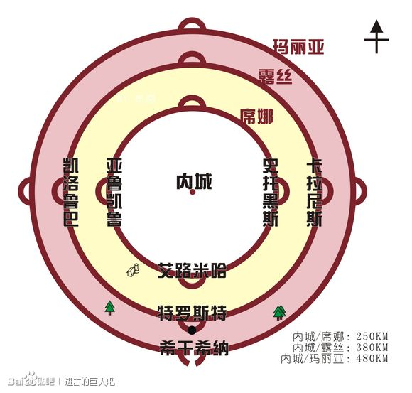

# 进击的巨人

### 人物名字

* 艾伦·耶格尔（艾连） 父亲 格里沙·耶格尔
* 阿尔敏
* 三笠·阿克曼(米卡莎)
* 汉尼斯大叔

----

* 希斯特利亚·雷斯（赫里斯塔·兰斯） (雷伊斯家族 与 壁教)

    希娜之墙北部小牧场出生,是贵族雷伊斯卿领地的某个牧场,她母亲一直在看书不做家务,祖父母只会在做事的时候交谈,母亲却从来不交谈,会被其他小朋友扔石头;尝试抱母亲后,母亲第一句话就是想杀了她,从此母亲就到别的地方生活.

    玛利亚之墙沦陷后,她的父亲罗德·雷伊斯找她，是这片土地领主的名号。也见到了母亲。

    准备逃的时候，被包围了起来。“因为玛利亚之墙被攻破而感到不安吗”，母亲不认自己，父亲也不承认与自己和母亲两个人有关系。周围人说抹除母亲的存在（没有在大屋工作过，应该以前是仆人），她眼睁睁看着母亲被割喉，母亲说了最后一句话 "要是没生下你的话",在她被杀之前,父亲提出改名为赫里斯塔

    知道墙壁秘密的人,为什么不是国王,而是雷伊斯家

    有个姐姐，在54话开头出现，教希斯特利亚学字，在艾伦测试硬化后突然脑海中出现了那个姐姐自己照镜子的记忆

* 尤弥尔

----

* 康尼·斯普林格（柯尼） 拉加果村
* 让·基尔希斯坦
* 萨莎·布劳斯

----

* 亚妮·雷恩哈特(阿尼·莱恩哈特)（女巨人）
* 莱纳·布朗（铠之巨人）
* 贝尔托特·胡佛（超大巨人）

----

* 埃尔文·史密斯 (艾维尔) (团长)
* 利威尔·阿克曼（兵长）
* 韩吉·佐耶

----

城墙

玛利亚之墙 /玛丽亚之墙（Wall·Maria)
南:希干希纳区(西甘希纳区)

罗塞之墙/露丝之墙（Wall·Rose）
东:卡拉尼斯区
南:托洛斯特区(特罗斯特) (被攻破过 但是补上) 驻屯兵团南部最高总司令 多托·匹西斯 / 达特·皮克希斯 / 皮克斯司令
西:凯洛鲁巴区
北:斯托海斯区(斯托黑斯) (被攻破?骗王室)

希娜之墙/席纳之墙（Wall·Sina）
东:史托黑斯区
南:艾路米哈区
西:亚鲁凯鲁区。
北：奥尔福德区
旧地下都市

王都 米托拉斯

达里斯·扎卡里 / 达里斯·萨克雷 / 扎卡雷总统
军团的最高统帅，人类阵营的总统。

尼可神父被他杀

训练兵团
宪兵团 - 中央宪兵团(对人立体机动装置) , 普通宪兵团
驻屯兵团
调查兵团

利布斯商会

虚报 斯托海斯区 被攻破后,王政府拒绝让难民进入,并说只要等那位大人得到那股力量就可以了 61 终幕

弗里兹 假冒王室 虽然权利实质还是掌握在雷伊斯家族手里
雷伊斯家 5个子女+私生女(希斯特利亚)
长女:弗丽达·雷伊斯 艾伦记忆中的 , 还有希斯特利亚小时候记忆的女

玛利亚之墙沦陷当晚 , 他们在村子唯一的教堂中遭到袭击,只有当家雷德·雷伊斯幸免
刚好发生在中央宪兵杀害希斯特利亚生母的几天前

5个子女 和 妻子 都被艾伦父亲格里沙·耶格杀害，了抢走雷伊斯家存放在弗丽达体内的巨人之力 ， 该力量立足于所有巨人的顶端，但是由于经验不足，驾驭不了，败了。

东洋一族和阿克曼家族都不受巨人篡改记忆能力的影响，并且不顺从王政府。所以遭到王政府的杀害，灭族

既然那个力量这么厉害，为什么100年内没有消灭巨人呢。
创建墙内世界的初代雷伊斯王确实希望 人类受巨人支配

始祖巨人

初代王不希望人类存续下去，东洋一族和阿克曼家族就是站在对立点上

* 基斯·加迪斯 上一任调查团长 艾伦父亲 出教堂后见到的人 喜欢艾伦母亲的人，在当年回墙内的路上遇到了艾伦爸爸，好好奇一个普通人怎么可以跑到墙外

--------------------
86话
艾尔迪亚人

* 菲·耶格尔 被马莱人用恶犬活活咬死
* 格里沙·耶格尔 继承枭的进击巨人能力（因为年限快到）  把能力给艾伦估计也是因为快到13年年限
* 戴娜·弗里茨 王家血统 拒绝上岛
* 吉克·耶格尔 格里沙·耶格尔+戴娜·弗里茨
* 艾伦·克鲁格 枭的真实身份

外出要戴袖章 (不带袖章要送去乐园), 不能到墙壁外面

雷伯利欧收容去

马莱

距今1820年前（艾伦父亲写下时间） , 祖先 尤弥尔·弗里茨 与 大地的恶魔 签下契约获得巨人之力

>尤弥尔死后将力量分为9份，创建了 "艾尔迪亚" 帝国，并将古国 "马莱" 灭亡了，成为大陆的支配者。自此世界进入了黑暗时代，荣有巨人之力的尤弥尔子民讲其他民族定为下等人进行压迫。还逼迫气人民族为他们繁衍子孙增加尤弥尔子民，就这样持续了1700年。
马莱进行反间计，让艾尔迪亚发生内战，弱化了艾尔迪亚。而且将9大巨人的7个巨人能力局为己用。并于80年前与艾尔迪亚巨人大战中取得胜利。

弗里茨 在 残余的国土 "帕拉迪岛" 上筑起了三重高墙，并带领部分国民逃到此地。其他国民就被抛弃在大陆。

>可能初代王就是因为发现，人类其实就是一直在复仇，侵略中度过。所以人类应该灭绝。

"艾尔迪亚复权派"

在马莱政府的内线,名为枭.提供资金,武器,历史文献;
>枭的历史文献,始祖尤弥尔耕种土地,铺设道路,在山谷中架桥,让大地上的人们过上富裕生活

弗里兹王 把巨人之力带到了高墙中，弗里兹王否定战争

随着科技的发展，巨人之力带来的优势已经远不及以燃料为基础的军事力量了。而 "帕拉迪岛" 有着大量的化石燃料。但是80年前，弗里兹王 留下的话 "今后若胆敢干涉吾等，吾将驱使墙内千万巨人踏平一切"

所以马莱国 与 艾尔迪亚复权派 都想在不刺激王的情况下,把始祖巨人力量据为己有.而"艾尔迪亚复权派"这边决定派"吉克·耶格尔"去当马莱战士.但是就在"吉克·耶格尔"7岁的时候,就向马莱士兵举报了 格里沙·耶格尔+戴娜·弗里茨夫妇,自己的亲生父母 还有 "艾尔迪亚复权派".

导致 他们和"艾尔迪亚复权派"全部被送往乐园,成为永远在"帕拉迪岛"游荡的食人巨人.

>马莱国的一个军官说 人的本质都是想看到残忍的画面

>继承巨人之力 会在13年后死去 - 称作尤弥尔的诅咒
如果巨人之力在死前并没有被吃掉,死后该巨人之力就会在他死后所诞生的尤弥尔子民婴儿继承.与距离,血缘无关(超越空间).

所有巨人,所有尤弥尔子民都与"始祖巨人"这个坐标相连.

艾伦:8年 爱尔敏:13年

继承的巨人:不管在哪一个时代,都会为了追求自由而不断前进,为了自由而战,名曰:进击的巨人

历史是服务于政府的.

地下室的秘密,三本书

* <格里沙·耶格尔的半生>
* <巨人与目前所知的全部历史>
* <墙外世界的情报>

实际 初代王(145代)已经与始祖巨人立下了不战之约,已经接受艾尔迪亚注定灭亡的命运.篡改了墙内所有人的记忆,让他们认为墙外已经无人生还.可能也是因此隐姓埋名,为了避免他人来掠夺"始祖巨人"之力

不战之约:想要发挥"始祖巨人"实力,必须要王室血统,但是王室血统一旦继承,就会拥有被145代王的记忆,从而被其控制而不战.

那为什么艾伦可以有一次控制巨人呢,难道是因为,他与"戴娜·弗里茨"变成的巨人接触后,瞬间拥有了"始祖巨人"力量.只有艾伦从父亲的记忆中看到"戴娜·弗里茨"变成巨人后的样子才知道,吞掉母亲和汉内斯大叔的巨人就是拥有王家血统的"戴娜·弗里茨".

艾伦推测可能把拥有拥有王家血统的人变成巨人后,艾伦与其接触,就能发挥"始祖巨人"之力

89话中 艾伦·克鲁格 叫 格里沙·耶格尔 在墙内成家,并保护三笠,爱尔敏但是却不知道这是谁,并且是谁的的记忆.猜想:
* 轮回 (感觉有点坑)
* 艾伦记忆的混乱,把自己想保护的人,三笠,爱尔敏的记忆与艾伦·克鲁格的记忆相混 (但是记忆中的父亲也问了三笠,爱尔敏是谁,虽然也有可能是艾伦自己脑补)
* 记忆的继承是超越时间 , 就是说那种与坐标的联系,不止止是超越空间,甚至超越时间 (但是这样不就会知道未来的事,所以好像也不太可能)

90 记者老头
就像我们想要消灭全部巨人那样,世界上的其他人也想消灭我们.只要在艾尔迪亚人全部消失后,地狱才会消失

在托洛斯特区遭到攻击后一年内,民众终于正式获准迁回希干希纳区,这一天,调查兵团进行长达六年的玛利亚之墙墙外调查.果然和汉吉判断一样,巨人几乎都在玛利亚之墙里面,在就在那一年里被调查兵团消灭殆尽.